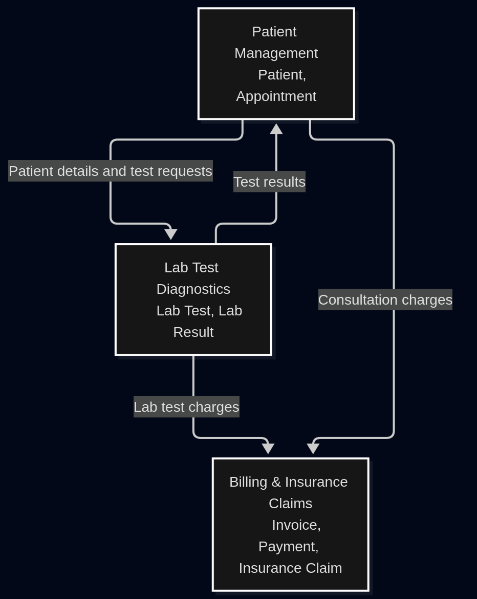

# SAD Week 2 Assignment

## Legacy Healthcare Portal Modernization

This repository contains the Week 2 Systems Analysis and Design practical assignment for the healthcare portal modernization scenario.

### Required bounded contexts

1. **Patient Management**
   - Patient
   - Appointment
2. **Billing & Insurance Claims**
   - Invoice
   - Payment
   - Insurance Claim
3. **Lab Test Diagnostics**
   - Lab Test
   - Lab Result

### Files

- [Mermaid context map](healthcareSAD/context-map.mmd)
- [Rendered context map](healthcareSAD/healthcare-context-map.png)
- [Patient Care user stories and Gherkin acceptance criteria](healthcareSAD/user-stories.md)

### Context Map

